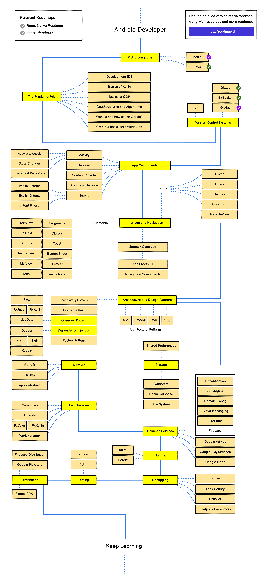

# 😎 Guia do Frontend 

Bem-vindo ao Guia do Android! Este repositório é o ponto de partida perfeito para quem quer mergulhar no universo do desenvolvimento de aplicativos Android. Aqui, você encontrará uma série de arquivos recheados de conceitos, exemplos práticos e links úteis para o desenvolvimento.

## 🗺️ Roadmap

Gosto muito do site [roadmap.sh](https://roadmap.sh/), pois nele é possível encontrar trilhas e recursos valiosos para o aprendizado de diferentes áreas da TI. 

Não se sinta pressionado a seguir cada passo desta trilha rigidamente. O desenvolvimento mobile é uma jornada pessoal, e você pode adaptar seu percurso de acordo com seus interesses, necessidades e objetivos. Use este roadmap como uma bússola, mas sinta-se à vontade para explorar caminhos que despertem mais sua curiosidade.

## 📚 Conteúdo:

### 1. Kotlin

- [Sintaxe Básica](./Kotlin/Sintaxe%20Básica.md)
- [Comentários](./Kotlin/Comentários.md)
- [Variáveis](./Kotlin/Variáveis.md)
- [Tipos de Variáveis](./Kotlin/Tipos%20de%20Variáveis.md)
- [Operadores](./Kotlin/Operadores.md)
- [Strings](./Kotlin/Strings.md)
- [Arrays](./Kotlin/Arrays.md)
- [Ranges](./Kotlin/Range.md)
- [Funções](./Kotlin/Funções.md)
- [Condicionais If](./Kotlin/Condicionais%20If.md)
- [Condicionais When](./Kotlin/Condicionais%20When.md)
- [For Loops](./Kotlin/For%20Loops.md)
- [Iteradores Personalizados](./Kotlin/Iteradores%20Personalizados.md)
- [While Loops](./Kotlin/While%20Loops.md)
- [Controle de Fluxo](./Kotlin/Controle%20de%20Fluxo.md)

#### Referências

- [Kotlin: Tutorialspoint](https://www.tutorialspoint.com/kotlin/index.htm)

## 🌐 Recursos Adicionais

## 🤝 Contribua!

Este guia está em constante crescimento, e sua contribuição é mais do que bem-vinda! Se você tem dicas, exemplos adicionais ou quer corrigir algo, sinta-se à vontade para abrir uma issue ou enviar um pull request. Vamos tornar este guia ainda mais incrível!

Divirta-se codificando! 🚀✨